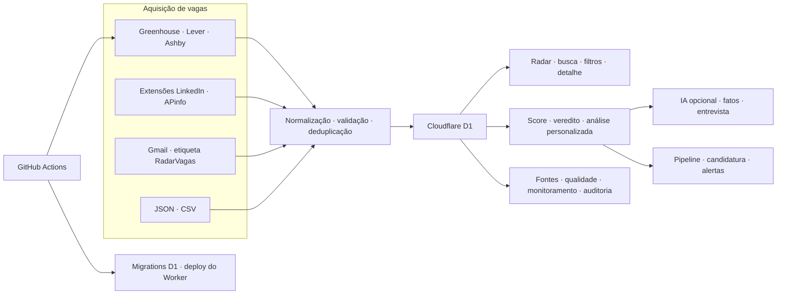
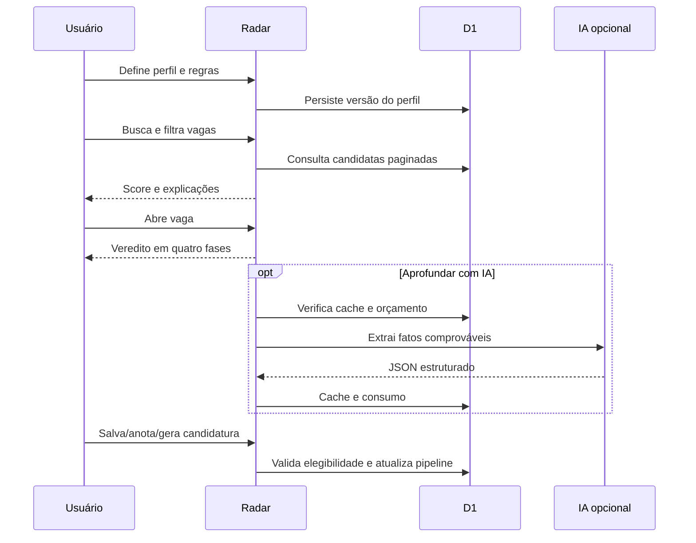
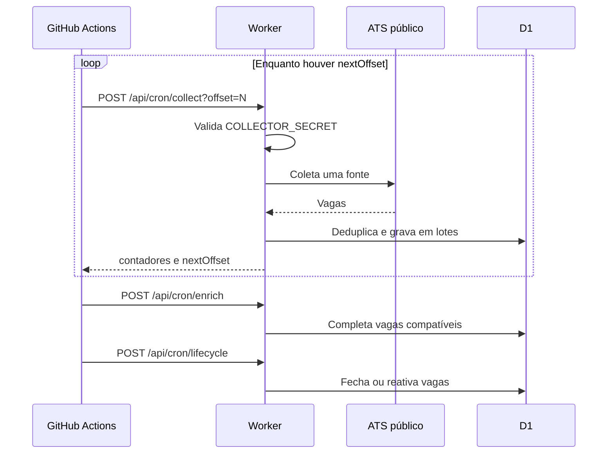

# Radar Carreira Platform — visão completa do produto e da arquitetura

> Documento de conhecimento do estado real do repositório em **13 de agosto de 2026**, baseado no commit `455010c` (`Corrige ações de candidatura e contato`).

## Como ler este documento

Este material descreve o que está implementado no código, não apenas o que aparece na interface. Ele reúne produto, regras de negócio, dados, segurança, integrações, operação, testes, limitações e pontos de atenção. Quando uma estrutura existe, mas ainda não forma um fluxo completo, isso é indicado explicitamente.

## 1. Resumo executivo

O Radar Carreira é uma plataforma web multiusuário para centralizar oportunidades, decidir quais vagas merecem atenção e acompanhar o processo seletivo. O produto combina quatro capacidades principais:

1. **Aquisição:** recebe vagas de ATS públicos, extensões de navegador, Gmail e arquivos JSON/CSV.
2. **Qualificação:** normaliza, deduplica, infere tecnologias, calcula aderência e aplica bloqueadores pessoais.
3. **Decisão e candidatura:** oferece veredito, análise persistida, aprofundamento opcional por IA, mensagem de candidatura e preparação para entrevista.
4. **Operação:** mantém pipeline pessoal, alertas, métricas, RBAC, auditoria, qualidade, backup, coleta agendada e publicação contínua.

O sistema é executado como um Cloudflare Worker, com interface Next.js/React compilada por vinext/Vite e persistência em Cloudflare D1 via Drizzle ORM.

### Estado funcional em uma frase

O fluxo central — entrar, cadastrar perfil, descobrir vaga, avaliar aderência, acompanhar candidatura e operar as fontes — está implementado; a governança RBAC avançada e alguns parâmetros administrativos ainda têm lacunas de integração descritas na seção 14.

## 2. Arquitetura em alto nível



### Fronteiras do sistema

- **Navegador:** React, experiência do Radar e extensões locais.
- **Servidor:** rotas App Router e regras sensíveis executadas no Worker.
- **Persistência:** um banco D1 identificado pelo binding `DB`.
- **Automação:** GitHub Actions chama endpoints protegidos e publica a aplicação.
- **Serviços externos:** APIs públicas dos ATS, Gmail via Apps Script e provedor compatível com OpenAI Chat Completions.

## 3. Stack e ferramentas

| Camada | Tecnologia | Papel no projeto |
|---|---|---|
| Aplicação | Next.js 16.2.6 | App Router, páginas, rotas HTTP e renderização |
| Interface | React 19.2.6 + React DOM | Dashboard e modais funcionais |
| Linguagem | TypeScript 5.9.3 | Aplicação, domínio e infraestrutura |
| Runtime de build | vinext 0.0.50 + Vite 8.0.13 | Compilação do Next.js para Cloudflare |
| Hospedagem | Cloudflare Workers | Runtime de produção e entrega de assets |
| Imagens | Cloudflare Images binding | Otimização pelo endpoint do vinext |
| Banco | Cloudflare D1 / SQLite | Dados do produto e operação |
| ORM | Drizzle ORM 0.45.2 | Schema tipado e consultas |
| Migrations | Drizzle Kit / SQL | Evolução do banco; 20 migrations (`0000` a `0019`) |
| Estilos | CSS próprio + Tailwind/PostCSS 4 | Identidade visual e layout |
| Fonte | Geist | Tipografia do produto |
| Automação | GitHub Actions | validação, coleta, revalidação e deploy |
| Integração Gmail | Google Apps Script | leitura da etiqueta e envio do resumo diário |
| Extensão | Chrome Manifest V3, JavaScript puro | coleta local do APinfo e integração com o Radar |
| Testes | Node.js test runner | testes estruturais, de regras e integração RBAC |
| Runtime mínimo | Node.js 22.13 | desenvolvimento, build e testes |

## 4. Experiência e módulos visíveis

O dashboard possui 14 entradas de navegação:

| Módulo | Público-alvo | O que entrega |
|---|---|---|
| Radar | Usuário | lista paginada, busca, filtros, ordenação, score, detalhe e ações |
| Pipeline | Usuário | acompanhamento individual, etapa, nota e candidatura |
| Alertas | Usuário | oportunidades dos últimos 7 dias, leitura e preferências |
| Métricas | Usuário | funil, conversão, empresas e tecnologias |
| Monitoramento | Operação | saúde do banco, fontes, falhas e execuções recentes |
| Auditoria | Operação | linha do tempo de importações e eventos de vagas |
| Qualidade | Operação | completude dos dados e enriquecimento |
| Usuários | Administração | contas locais, perfis, convites e papel básico |
| Extensão LinkedIn | Administração | chave exclusiva e instruções de conexão |
| Extensão APinfo | Administração | chave exclusiva, conexão e importação alternativa |
| Gmail RadarVagas | Administração | chave do Apps Script e integração de e-mail |
| Fontes | Operação | catálogo, cadastro, teste, ativação e coleta de ATS |
| Importações | Operação | envio manual de JSON ou CSV |
| Configurações | Administração | chaves operacionais, períodos, retenção e manutenção da base |

### Radar de vagas

- Busca por código externo, título, empresa, localização, senioridade e stack.
- Períodos: 24 horas, 3 dias, 7 dias ou todo o histórico.
- Fontes: todas, LinkedIn, APinfo ou demais fontes.
- Pipeline: todas, não vistas, vistas, salvas, candidaturas, entrevistas e rejeitadas.
- Veredito: todos, `✅`, `🟡`, `🔴` ou `❌`.
- Aderência mínima numérica, inclusive o mínimo definido no perfil.
- Ordenação por aderência/publicação ou por importação.
- Paginação no banco; filtros que exigem cálculo pós-consulta examinam até 150 candidatas.
- Modo degradado: em falha da personalização, tenta novamente e carrega uma resposta enxuta sem dados demonstrativos.
- Estado de filtros, vaga selecionada e rolagem preservados na sessão do navegador.
- Descrição carregada sob demanda, higienizada e organizada em blocos.
- Ações de copiar descrição, compartilhar, abrir anúncio original e exportar resultado.

### Detalhe e candidatura

- Identifica LinkedIn, APinfo, Greenhouse, Lever, Ashby, Gupy e Quickin pela URL para nomear a ação.
- Mantém `url` estável separada de `applyUrl`, que pode conter token temporário de candidatura.
- Em vagas APinfo, pode abrir a busca pelo código usando o formulário POST exigido pelo site.
- Contato APinfo é capturado manualmente pela extensão e salvo uma única vez; concorrência é protegida com atualização condicional.
- A mensagem de candidatura usa somente competências confirmadas, pode explicitar lacunas e nunca envia e-mail automaticamente.
- Acompanhamento da candidatura distingue `generated`, `sent` e `responded`, com data própria para cada marco.

## 5. Perfil profissional

Cada usuário possui preferências próprias:

- senioridades aceitas;
- modalidades preferidas;
- competências dominadas;
- áreas desejadas;
- termos a evitar;
- score mínimo;
- regras estratégicas de carreira.

As regras estratégicas incluem nome e título profissional, resumo, localização-base, regiões aceitas, máximo de dias híbridos, contratos preferidos, idiomas de comunicação, senioridades e tipos de atuação bloqueados, stack principal, exceções técnicas, projeto-âncora, política de transparência sobre lacunas e limite mensal de tokens de IA.

Listas legadas separadas por vírgula continuam aceitas, mas são persistidas como JSON. Entradas são normalizadas e limitadas antes da gravação.

## 6. Motor de decisão

O produto possui três mecanismos complementares; eles não devem ser confundidos.

### 6.1 Score numérico (0 a 100)

O score serve para ordenar e filtrar:

| Critério | Efeito |
|---|---:|
| Vaga reconhecida como TI | +5 |
| Competências dominadas encontradas | até +60, proporcionalmente |
| Área desejada | +15 |
| Senioridade compatível | +10 |
| Senioridade divergente explícita no título | -10 |
| Modalidade preferida | +10 |
| Presencial/híbrido fora da área aceita | -20 a -25 |
| Divergência leve de modalidade | -5 a -10 |
| Publicada nas últimas 24 horas | +5 |
| Termo bloqueado | score 0 |
| Vaga fora de TI | score 0 e sem aderência |

Detalhes importantes:

- A correspondência de skills respeita limites de palavra; `R` não casa com `React` e `Go` não casa dentro de outra palavra.
- Se a pessoa escolheu senioridades, vaga sem senioridade declarada não é considerada compatível nesse filtro.
- Para presencial/híbrido, o motor reconhece São Paulo, Mogi das Cruzes, Grande São Paulo e ABC como áreas aceitas no algoritmo numérico atual.
- Vagas fora de TI permanecem visíveis por transparência, mas não recebem veredito.

### 6.2 Veredito estratégico

O veredito avalia a vaga em fases e retorna:

- `✅ Bate`;
- `🟡 Provável com ressalvas`;
- `🔴 Não bate`;
- `❌ Bloqueador estrutural`.

Ordem dos bloqueadores da fase 1:

1. stack incompatível;
2. idioma obrigatório não aceito;
3. senioridade incompatível;
4. tipo de atuação bloqueado;
5. geografia ou frequência híbrida fora da regra.

Somente após esses vetos o motor avalia contratação, fit técnico, tipo de empresa/intermediário e ressalvas. Equivalências conservadoras são aceitas (`GCP`/Google Cloud, `.NET`/C#, `Postgres`/PostgreSQL etc.). Há exceções configuráveis e duas exceções embutidas: `VBA + Access + SQL Server` e `QA .NET Sênior`.

### 6.3 Análise por IA

A IA é opcional e não substitui as regras determinísticas. Quando configurada:

- extrai somente fatos apoiados na descrição;
- estrutura contrato, idioma, tipo de empresa, domínio, cultura, ambiguidades, evidências e perguntas de entrevista;
- limita e valida a estrutura retornada;
- usa cache global por vaga, hash da descrição e versão do analisador;
- contabiliza tokens por usuário e mês;
- bloqueia a chamada antes do provedor se a estimativa exceder o orçamento;
- registra sucesso, falha ou bloqueio de orçamento;
- monta um briefing de entrevista com lacunas e projeto-âncora.

Configuração aceita: `OPENAI_API_KEY`/`OPENAI_MODEL` ou `AI_API_KEY`/`AI_MODEL`/`AI_PROVIDER`, com `OPENAI_BASE_URL` ou `AI_BASE_URL` para endpoint compatível.

## 7. Regras de acompanhamento

- Uma vaga só pode entrar no pipeline ou ter análise persistida se o veredito for `✅` ou `🟡`.
- O usuário precisa ter perfil e competências cadastradas.
- Marcar como apenas visualizada não sobrescreve uma etapa já existente.
- Estados de candidatura nunca regridem: `generated` → `sent` → `responded`.
- Gerar a mensagem leva a vaga para `saved`; enviar ou responder leva para `applied`, salvo quando já está em entrevista, rejeitada ou arquivada.
- Notas e etapas são individuais por usuário e vaga.
- E-mails do LinkedIn reconhecidos podem atualizar automaticamente o pipeline quando existe uma única correspondência de vaga.

## 8. Aquisição, normalização e deduplicação

### Campos canônicos de uma vaga

Empresa, cargo e URL são obrigatórios. São aceitos ainda código externo, senioridade, modalidade, localização, stack, data, descrição, fonte, URL de candidatura, e-mail e assunto de contato.

### Normalização

- Cabeçalhos em português e inglês são mapeados para o modelo canônico.
- CSV aceita vírgula ou ponto e vírgula, aspas e BOM UTF-8.
- Localização vinda do LinkedIn é simplificada antes do separador `·`.
- Modalidade pode ser inferida de localização e descrição.
- ID do LinkedIn pode ser extraído da URL.
- Quando a data de publicação é inválida ou ausente, usa-se o momento da coleta.

### Deduplicação

O fingerprint FNV-1a de 32 bits usa empresa, cargo, localização e URL normalizados. `applyUrl` e contato ficam fora do fingerprint para permitir atualizar tokens e contatos sem duplicar a vaga.

Nas importações por e-mail, o ID externo do LinkedIn também participa da busca da vaga existente. Lotes repetidos são idempotentes: conflitos atualizam o registro e preservam contato já conhecido com `coalesce`.

### Limites operacionais

- Importação manual: até 2 MB e 2.000 vagas.
- CSV: no máximo 2.000 linhas de dados.
- Extensões: até 2.000 vagas por envio.
- Escritas D1: lotes de 50; consultas de fingerprints: lotes de 100.
- Coleta agendada: uma fonte por chamada, percorrida por `offset`; em execução manual, `start_offset` permite retomar de um ponto específico.
- Resiliência da coleta: pausa entre fontes, até seis tentativas para falhas transitórias e janela máxima de recuperação de 120 segundos por chamada.
- Descrição de ATS: normalizada e limitada a 12.000 caracteres por vaga antes da gravação, para respeitar os limites operacionais de Worker e D1.

## 9. Fontes e integrações

### ATS públicos

| Provedor | Endpoint | Dados principais |
|---|---|---|
| Greenhouse | Boards API | ID, cargo, local, atualização, URL e conteúdo |
| Lever | Postings API | ID, cargo, local, workplace type, URL e descrição |
| Ashby | Posting API | ID, cargo, local, remoto, publicação, URLs e descrição |

O identificador precisa conter apenas letras, números, `_` ou `-`. Chamadas têm timeout de 15 segundos. A validação classifica a fonte como `ok`, `empty`, `mismatch` ou `error`; Greenhouse e Ashby comparam também o nome encontrado.

O catálogo curado contém dezenas de boards previamente verificados. Slugs ambíguos exigem revisão manual, e fontes com board vazio ou colisão de empresa ficam em quarentena no código.

### Gmail RadarVagas

O Apps Script envia mensagens recentes da etiqueta exata `RadarVagas` usando Bearer token. O banco armazena apenas SHA-256 da chave e o usuário associado.

O conector:

- aceita somente a etiqueta esperada;
- extrai vagas de alertas do LinkedIn;
- reconhece assuntos de candidatura enviada ou visualizada;
- atualiza o pipeline apenas quando encontra uma correspondência única;
- tenta enriquecer descrições usando uma vaga oficial equivalente;
- prepara um resumo diário e aguarda confirmação de envio para marcar a entrega.

### Extensões de coleta

O endpoint genérico aceita somente `linkedin-extension` e `apinfo-extension`. Cada fonte tem uma chave própria, armazenada apenas como hash. Há CORS para `POST` e `OPTIONS`, teste de conexão e importação idempotente.

O repositório inclui a extensão APinfo Manifest V3 (manifesto atual `1.6.2`), que:

- coleta a página atual ou percorre páginas sem filtro com intervalo configurável;
- interrompe diante do limite de consultas do site;
- acumula e deduplica localmente por código;
- filtra por stacks na exportação;
- gera CSV/JSON no navegador;
- envia vagas ao Radar quando autorizado;
- captura contato somente após ação explícita e login manual no APinfo;
- usa uma ponte nas páginas do Radar para devolver o contato correto por código;
- não lê senha, não automatiza login e não envia candidatura.

### Enriquecimento e ciclo de vida

- Uma vaga de alerta pode receber descrição, stack, senioridade, modalidade e local de uma vaga oficial quando empresa e cargo normalizados têm correspondência única.
- Fontes ATS atualizam `lastSeenAt` a cada coleta.
- Após `staleAfterDays`, a vaga vira `possibly_closed`; após o dobro, `closed`; se reaparecer, volta a `active`.
- Cada transição gera um evento.

## 10. Dados e persistência

O schema atual possui 22 tabelas:

| Tabela | Responsabilidade |
|---|---|
| `profiles` | identidade, papel básico, preferências, regras e versão do perfil |
| `local_accounts` | credenciais locais derivadas e origem do convite |
| `job_sources` | configuração, modo, saúde e validação das fontes |
| `jobs` | registro canônico, URLs, contato, status e datas da vaga |
| `user_job_status` | pipeline, nota e marcos da candidatura por usuário |
| `user_job_analyses` | análise elegível persistida por usuário e vaga |
| `job_ai_facts` | cache factual de IA por vaga e versão da descrição |
| `ai_usage_events` | consumo, operação e resultado de chamadas de IA |
| `job_events` | eventos de ciclo de vida, enriquecimento e candidatura |
| `import_runs` | execução, origem, contadores, ator e falhas de importação |
| `platform_settings` | parâmetros operacionais globais |
| `alert_preferences` | ativação, frequência e score mínimo individual |
| `alert_reads` | vagas já lidas pelo usuário |
| `alert_deliveries` | preparação e confirmação de resumos diários |
| `roles` | perfis RBAC |
| `permissions` | catálogo fixo de capacidades administrativas |
| `role_permissions` | permissões de cada role |
| `groups` | grupos de acesso |
| `group_roles` | roles herdadas por grupo |
| `user_roles` | roles atribuídas diretamente a usuários |
| `user_groups` | grupos atribuídos a usuários |
| `access_audit_log` | trilha prevista para mudanças de acesso |

### Relações relevantes

- `jobs.source_id` aponta para `job_sources`.
- Pipeline, análises, fatos de IA, eventos e leituras apontam para `jobs`.
- A chave composta usuário + vaga impede duplicidade no pipeline, na análise e nas leituras.
- Roles chegam ao usuário diretamente ou pela associação grupo → role.
- Várias listas são armazenadas como JSON textual por compatibilidade com D1/SQLite.

### Evolução do banco

As migrations cobrem plataforma inicial, alertas, entregas, contas locais, saúde/modo das fontes, papel administrativo global, validação, RBAC e seeds, URLs/contato, correção de datas, regras de carreira, análises, contabilidade de IA, remoção de análises inelegíveis e acompanhamento de candidatura.

## 11. Autenticação, autorização e segurança

### Formas de autenticação

1. **Sign in with ChatGPT:** somente quando o host termina em `.chatgpt.site`; identidade vem de cabeçalhos protegidos.
2. **Conta local:** e-mail/senha, sessão HMAC em cookie seguro, HTTP-only, SameSite Lax e duração de 12 horas.
3. **Desenvolvimento local:** usuário fixo apenas em `localhost`/`127.0.0.1`.

Senhas locais usam PBKDF2-SHA-256, sal aleatório de 16 bytes, 25.000 iterações e comparação sem saída antecipada. A aplicação exige no mínimo quatro caracteres; o utilitário de bootstrap do proprietário exige oito.

### RBAC

`can()` concede acesso pela união de roles diretas e herdadas de grupos. O e-mail proprietário tem bypass explícito, independente do banco.

Existem 21 permissões cadastradas, entre elas fontes, coleta, importação, estatísticas, exclusão, configurações, monitoramento, qualidade, auditoria, backup, relatório, integrações, usuários, roles e grupos.

Perfis iniciais:

- **Admin operacional:** ampla operação, sem exclusão em massa, mudança de papel ou governança RBAC.
- **Curador de fontes:** fontes, coleta e monitoramento.
- **Visualizador:** leitura administrativa.

`roles.manage` e `groups.manage` não podem ser adicionadas a uma role pela API; na prática permanecem exclusivas do proprietário. Roles do sistema não podem ser excluídas e qualquer role vinculada precisa ser desatribuída antes da exclusão.

### Proteções de integração

- Cron de coleta, enriquecimento e ciclo de vida usa `COLLECTOR_SECRET`, removido pelo Worker antes do encaminhamento e substituído por cabeçalho interno.
- Gmail e extensões armazenam apenas hash SHA-256 das chaves.
- A rota de revalidação aceita sessão autorizada ou secret próprio.
- Credenciais de IA nunca são devolvidas ao navegador.
- Backup mascara a configuração protegida do Gmail e remove `updatedBy` das configurações.

## 12. Inventário de APIs

### Usuário e produto

| Método e rota | Função |
|---|---|
| `GET /api/health` | saúde do banco e latência |
| `GET/PUT /api/profile` | consultar/criar e atualizar perfil |
| `GET /api/jobs` | listar, buscar, filtrar, pontuar e paginar vagas |
| `POST /api/jobs/detail` | carregar descrição detalhada |
| `GET/POST /api/jobs/:id/analysis` | consultar ou persistir análise elegível |
| `POST /api/jobs/:id/intelligence` | fatos de IA e briefing de entrevista |
| `POST /api/jobs/:id/application` | avançar estado da candidatura |
| `PATCH /api/jobs/:id/contact` | salvar contato APinfo uma única vez |
| `GET/POST/DELETE /api/pipeline` | listar, mover/anotar e remover do pipeline |
| `GET/PUT/POST /api/alerts` | consultar, configurar e marcar alertas lidos |
| `GET /api/analytics` | métricas pessoais e rankings |
| `GET /api/ai/status` | provedor e consumo mensal de IA |

### Autenticação

| Método e rota | Função |
|---|---|
| `GET /api/auth/chatgpt` | encaminhar para autenticação hospedada |
| `POST /api/auth/register` | criar conta local e sessão |
| `POST /api/auth/login` | validar conta local e criar sessão |
| `POST /api/auth/logout` | remover sessão local |

### Administração

| Método e rota | Função |
|---|---|
| `GET /api/admin/audit` | linha do tempo de importações e vagas |
| `GET /api/admin/backup` | backup JSON protegido |
| `POST /api/admin/collect` | coleta manual individual, geral ou do catálogo |
| `GET/POST /api/admin/collector-key` | consultar/criar chave legada do coletor |
| `GET/POST /api/admin/collector-key/:sourceId` | chave por extensão permitida |
| `POST /api/admin/gmail-key` | configurar a chave Gmail |
| `POST /api/admin/import` | importar JSON/CSV |
| `GET/DELETE /api/admin/jobs` | estatísticas e exclusão de vagas |
| `GET /api/admin/monitor` | diagnóstico operacional |
| `GET /api/admin/permissions` | catálogo RBAC |
| `GET/POST /api/admin/quality` | relatório e enriquecimento |
| `POST /api/admin/report` | exportação CSV compatível com Excel |
| `GET/POST /api/admin/roles` | listar e criar roles |
| `PATCH/DELETE /api/admin/roles/:roleId` | editar e excluir roles |
| `GET/PUT /api/admin/settings` | consultar e editar parâmetros |
| `GET/POST/PUT/PATCH /api/admin/sources` | listar, cadastrar, ativar catálogo e pausar fontes |
| `POST /api/admin/sources/test` | testar uma fonte ATS |
| `POST /api/admin/sources/revalidate` | revalidar fontes cadastradas |
| `GET/POST /api/admin/users` | listar e convidar usuários |
| `PATCH /api/admin/users/:userId` | alterar papel básico, protegido para owner |

### Integrações e automações

| Método e rota | Função |
|---|---|
| `OPTIONS/POST /api/collector/import` | endpoint legado da extensão LinkedIn |
| `OPTIONS/POST /api/collector/import/:sourceId` | entrada por extensão em allowlist |
| `POST /api/cron/collect` | coleta ATS paginada por fonte |
| `POST /api/cron/email-import` | importação de mensagens Gmail |
| `POST /api/cron/digest` | preparar/confirmar resumo diário |
| `POST /api/cron/enrich` | enriquecer vagas por fonte oficial |
| `POST /api/cron/lifecycle` | reconciliar vagas desatualizadas |

## 13. Operação e entrega contínua

### Workflows

| Workflow | Gatilho | Comportamento |
|---|---|---|
| `Validar e publicar o Radar` | push/PR em `main`, manual | instala, builda, lint; no push aplica migrations D1 e publica o Worker |
| `Coleta diária de vagas` | 11:15 UTC em dias úteis, manual | percorre fontes por offset; depois enriquece e reconcilia ciclo de vida |
| `Revalidar fontes` | segunda, 06:00 UTC, manual | chama a revalidação do ambiente de produção |

O deploy tem concorrência exclusiva para produção e não cancela publicação em andamento. A validação do workflow executa apenas `tests/rendered-html.test.mjs`; a suíte local completa é mais ampla.

### Variáveis e segredos operacionais

| Nome | Local | Uso |
|---|---|---|
| `CLOUDFLARE_API_TOKEN` | GitHub secret | migrations e deploy |
| `CLOUDFLARE_ACCOUNT_ID` | GitHub secret | conta de produção |
| `RADAR_BASE_URL` | GitHub variable | base da coleta agendada |
| `COLLECTOR_SECRET` | GitHub/Worker secret | autenticar cron operacional |
| `REVALIDATION_SECRET` | GitHub/Worker secret | revalidar fontes |
| `RADAR_SESSION_SECRET` | Worker secret | assinar sessões locais |
| variáveis `OPENAI_*` ou `AI_*` | Worker secrets/vars | aprofundamento por IA |

### Comandos de desenvolvimento

```bash
npm install
npm run dev
npm run build
npm run lint
npm test
npm run test:rbac-integration
npm run db:generate
```

## 14. Testes e garantias atuais

A base contém testes para:

- renderização e presença dos recursos centrais;
- autenticação local, contas convidadas e proteção administrativa;
- normalização de JSON/CSV, CORS, lotes e idempotência;
- extração de alertas e sinais de candidatura do Gmail;
- regras de score, senioridade, modalidade, recência e escopo de TI;
- bloqueadores, exceções, equivalências e fases do veredito;
- conteúdo seguro da mensagem APinfo;
- validação da resposta de IA, orçamento e briefing;
- RBAC estrutural e integração real com SQLite em memória;
- paginação e limites de recursos do Worker;
- período padrão e busca por código.

`npm test` executa build e testes `*.test.mjs`. A integração RBAC roda separadamente com loaders que simulam bindings Cloudflare e usa as migrations reais `0010`/`0011`.

## 15. Pontos de atenção confirmados

Estes itens foram observados no código atual e devem orientar próximas decisões:

| Prioridade | Ponto | Impacto |
|---|---|---|
| Alta | `POST /api/admin/report` exige autenticação, mas não verifica `report.export` | o catálogo RBAC promete uma restrição que a rota não aplica |
| Alta | `offer` aparece no pipeline aceito e nas métricas, mas não no enum Drizzle de `user_job_status.stage` | modelo, API e métricas não compartilham o mesmo conjunto formal de etapas |
| Alta | exclusão de vagas remove pipeline, leituras e eventos, mas não remove explicitamente análises, fatos de IA e entregas antes de `jobs` | FKs sem cascade podem bloquear exclusões de vagas já analisadas |
| Média | grupos, `user_roles`, `user_groups` e `access_audit_log` existem no banco, porém não há rotas/UI de atribuição nem gravação de auditoria de acesso | RBAC granular está parcialmente operacional, não administrável de ponta a ponta |
| Média | `platform_settings.emailImportEnabled`, `enrichmentEnabled` e `retentionDays` são editáveis, mas os respectivos fluxos não consultam todos esses valores | parte da tela de parâmetros funciona como configuração declarativa, sem efeito completo |
| Média | convite e cadastro aceitam senha de 4 caracteres, enquanto o bootstrap exige 8 e o planejamento antigo cita 12 | política de senha inconsistente entre fluxos e documentação histórica |
| Média | cache de fatos de IA é global por vaga, mas o consumo é atribuído apenas ao usuário que gerou o cache | usuários seguintes recebem o resultado sem novo evento de consumo; comportamento é eficiente, mas deve ser política explícita |
| Média | filtro com score/veredito calcula no máximo 150 candidatos antes de paginar | resultados muito extensos podem ter total/páginas limitados nesse modo |
| Média | `test:rbac-integration` forma o caminho `C:\\C:\\...` nos loaders quando executado neste Windows com Node 24 | a suíte de integração não inicia nesse ambiente, embora os 57 testes regulares e o build passem |
| Baixa | README da extensão informa versão 1.5.1, mas o manifesto está em 1.6.2 | documentação local da extensão está desatualizada |
| Baixa | `defaultMinScore` global é configurável, porém a listagem usa o score solicitado/perfil e não esse valor como fallback | parâmetro pode não produzir o efeito esperado no Radar |
| Baixa | health verifica banco; não verifica ATS, Gmail, IA nem secrets | “healthy” significa essencialmente D1 disponível |

### Limitações assumidas pelo desenho

- ATS e APinfo podem mudar APIs/HTML sem aviso.
- A URL de candidatura APinfo pode expirar; a URL estável é apenas referência por código.
- O enriquecimento exige uma única correspondência exata de empresa e cargo normalizados.
- Alertas no portal examinam 100 vagas de 7 dias; o resumo diário examina 250 vagas de 24 horas e envia no máximo 10.
- Métricas de mercado usam as 500 vagas mais recentes, não toda a base.
- O backup administrativo não inclui perfis, contas locais, preferências, pipeline, RBAC, análises ou uso de IA; portanto é operacional, não uma restauração integral do produto.
- Cada implantação com outro D1 começa com dados independentes.

## 16. Mapa do repositório

| Caminho | Responsabilidade |
|---|---|
| `app/Dashboard.tsx` | experiência principal e coordenação dos módulos |
| `app/api/` | contratos HTTP e casos de uso do servidor |
| `app/*.tsx` | módulos visuais de operação, perfil e administração |
| `lib/scoring.ts` | score numérico e elegibilidade de senioridade |
| `lib/verdict.ts` | veredito em fases e análise de stack |
| `lib/personalized-analysis.ts` | composição da análise por perfil |
| `lib/ai-provider.ts` | provedor, extração e validação de fatos |
| `lib/job-intelligence.ts` | preparação de entrevista |
| `lib/connectors.ts` | Greenhouse, Lever e Ashby |
| `lib/import-jobs.ts` / `csv-jobs.ts` | normalização de importações |
| `lib/email-jobs.ts` | alertas e candidatura via Gmail |
| `lib/enrichment.ts` / `lifecycle.ts` | qualidade e estado da vaga |
| `lib/rbac.ts` / `access.ts` | autorização granular e proteção do owner |
| `db/schema.ts` | modelo de dados tipado |
| `drizzle/` | histórico de migrations |
| `worker/index.ts` | fronteira Cloudflare, cron e imagens |
| `.github/workflows/` | validação, deploy e rotinas |
| `extensao-apinfo/` | extensão Chrome independente |
| `public/gmail-radarvagas.gs` | conector Apps Script |
| `tests/` | regras, integração e limites operacionais |

## 17. Fluxos essenciais

### Descoberta até candidatura



### Coleta agendada



Em caso de indisponibilidade transitória, a chamada é repetida com intervalo controlado. Se for necessário retomar manualmente uma execução, o workflow aceita `start_offset`, evitando reprocessar as fontes anteriores. A validação operacional de 13/08/2026 confirmou o percurso das fontes restantes — incluindo Capco, com 734 vagas — e verificou enriquecimento e reconciliação do ciclo de vida. Um ciclo integral que se recupere de um `503` continua como verificação operacional pendente.

## 18. Definição prática do produto hoje

O Radar já é mais que um agregador: ele é um sistema pessoal de decisão de carreira com operação multiusuário. Seu diferencial técnico está na combinação de regras explicáveis, veto estratégico, rastreabilidade e IA limitada a fatos, mantendo a pessoa no controle da candidatura.

Para evoluir com segurança, os próximos ajustes devem priorizar consistência de autorização e modelo de pipeline, aplicação efetiva dos parâmetros administrativos, cobertura de exclusão referencial e conclusão da administração RBAC. Essas correções consolidam estruturas que já existem sem exigir uma mudança de arquitetura.
